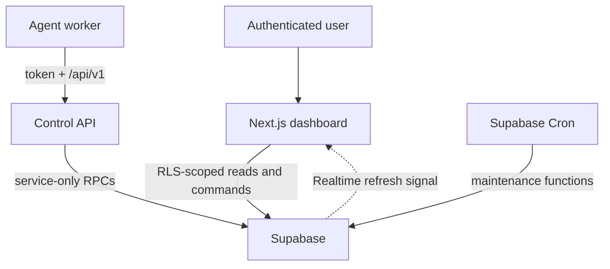

# Architecture

## System boundaries

Agent HQ separates four availability domains:

1. **Dashboard** — authenticated Next.js UI.
2. **Control-plane API** — Next.js route handlers for telemetry and commands.
3. **Source of truth** — Supabase Postgres/Auth/Realtime.
4. **Agent runtime** — an independent worker that may live in a container, server, CI runner, or API service.

Closing the dashboard does not affect the API, database, or a separately deployed worker. Deploying the dashboard does not make a temporary ChatGPT or Codex session permanent.

## Data model

| Record                            | Purpose                                                   | Isolation                                    |
| --------------------------------- | --------------------------------------------------------- | -------------------------------------------- |
| `workspaces`, `workspace_members` | Tenant ownership and membership                           | User RLS                                     |
| `agents`                          | Stable agent identity, capability, runtime, status        | Workspace RLS                                |
| `agent_tokens`                    | SHA-256 token hashes, prefixes, revocation                | Service-only; no browser grant               |
| `workers`                         | Persistent runtime identity and heartbeat                 | Workspace read RLS                           |
| `tasks`                           | Durable work, scheduling, lease, status, reported metrics | Workspace RLS; controlled writes through RPC |
| `task_attempts`                   | Visible retry/lease history                               | Workspace read RLS                           |
| `agent_events`                    | Immutable idempotent event/log history                    | Workspace read RLS                           |
| `artifacts`                       | Runtime-reported file/link metadata                       | Workspace read RLS                           |
| `schedules`                       | Recurring interval task templates                         | Workspace RLS                                |
| `notifications`                   | Persisted failures/offline alerts                         | Workspace RLS                                |
| `command_audit`                   | User/worker control history                               | Workspace read RLS                           |
| `api_rate_limits`                 | Per-credential fixed-window counters                      | Service-only                                 |

All tenant tables include `workspace_id`. Foreign keys and indexes cover ownership, queue scans, leases, timelines, and RLS predicates.

## Truthful state

- Progress is nullable. `null` means unavailable and renders as such.
- Running duration is `now - started_at`; terminal duration is `finished_at - started_at`.
- A heartbeat newer than 90 seconds is live, 90–300 seconds is stale, and older than 300 seconds is offline.
- Browser-side health calculation provides immediate display accuracy. Supabase Cron persists offline state, expires leases, and queues due schedules every minute without a browser. `/api/cron/maintenance` remains an authenticated fallback for operators.
- Realtime is not authoritative. It triggers a server refresh; Postgres rows remain canonical.
- Events have client-generated `eventId` values unique per agent. A retry returns `duplicate: true` without repeating a transition.
- Delayed events remain in history but do not regress a task whose `last_event_at` is newer.

## Queue and worker safety

`claim_next_task` performs an atomic `UPDATE` around `FOR UPDATE SKIP LOCKED`, ordered by priority and queue time. The database issues a unique `lease_id`, records an attempt, and increments `attempt_count` in the same transaction. Worker updates must match agent, worker, task, lease, and unexpired lease. Expired leases are returned to the queue while attempts remain, otherwise they fail visibly.

The supplied webhook worker never executes task text as code or a shell command. It sends structured JSON to one explicitly configured HTTPS handler.

## API versioning

The stable contract is under `/api/v1`. Every JSON response includes `Agent-HQ-API-Version`. Legacy event and registration paths delegate to v1; registration now requires an authenticated workspace administrator.

## Scaling

- Agents are generic workspace records, not hard-coded product types.
- Queue claims use partial/composite indexes and `SKIP LOCKED` for multiple workers.
- Logs and lists are bounded. A production expansion should replace the current top-100 views with keyset pagination.
- Rate limits are shared in Postgres rather than server-instance memory.
- Artifacts store metadata and protected storage paths; large file bytes should live in a private object-storage bucket.
